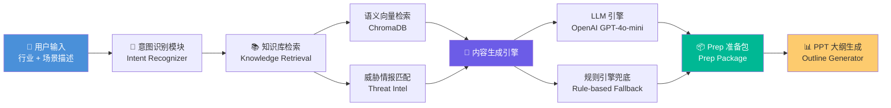
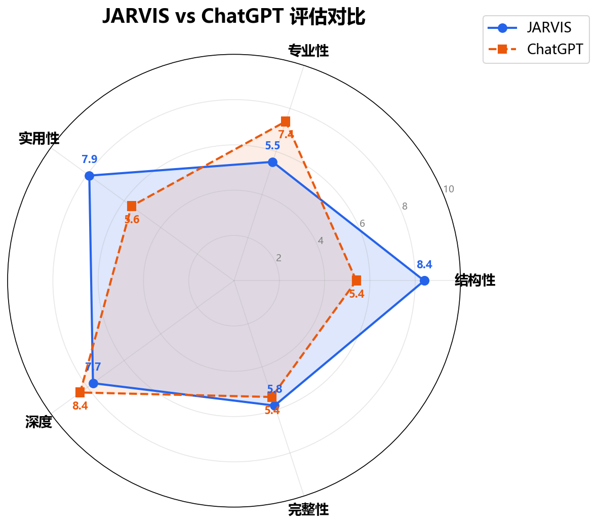

# JARVIS — AI 驱动的售前智能 Prep 助手

<p align="center">
  <strong>输入行业与场景，一键生成专业售前准备包与 PPT 大纲</strong>
</p>

<p align="center">
  <a href="https://github.com/Gothbo/jarvis-prep-assistant/actions/workflows/ci.yml">
    
  </a>
  
  
  
</p>

<p align="center">
  <a href="https://jarvis-prep-assistant.streamlit.app">在线演示 (Streamlit Cloud)</a>
  ·
  <a href="#功能亮点">功能</a>
  ·
  <a href="#系统架构">架构</a>
  ·
  <a href="#快速开始">快速开始</a>
</p>

---

JARVIS 是一款面向网络安全产品销售人员的 AI 售前准备助手。通过输入 **行业 + 场景**，系统自动完成意图识别、领域知识检索与 LLM 生成，在数分钟内输出结构化的 **售前准备包 (Prep Package)** 和 **PPT 演示大纲**，帮助销售团队高效备战客户拜访。

> **核心价值**：将"2 小时手动准备"压缩至"2 分钟自动生成"，同时保证输出内容的专业性与行业针对性。

## 功能亮点

- **智能意图识别** — 基于行业关键词与场景描述，自动解析客户痛点、采购阶段和决策角色，精准定位售前策略方向。
- **领域知识检索** — 集成 ChromaDB 向量数据库，对安全产品知识库、行业威胁情报进行语义检索，确保生成内容有据可依。
- **LLM + 规则引擎双保险** — 优先调用 OpenAI GPT-4o-mini 生成高质量内容；当 API 不可用时，自动回退至规则引擎兜底，保障系统可用性。
- **结构化 Prep 包输出** — 生成包含客户痛点分析、产品卖点匹配、竞品对比、FAQ 预判在内的完整售前准备文档。
- **PPT 大纲一键生成** — 根据 Prep 包内容自动编排演示文稿大纲，支持按方法论（SPIN / Challenger Sale）灵活调整叙事结构。

## 系统架构



**数据流简述**：用户输入 → 意图识别 → 知识库语义检索（产品案例 + 行业威胁情报）→ LLM / 规则引擎生成 → Prep 准备包 → PPT 演示大纲

## 技术选型

| 技术 | 选择 | 理由 | 备选方案 |
|------|------|------|----------|
| **编程语言** | Python 3.11+ | 生态最丰富的 AI/NLP 语言，类型提示完善，asyncio 原生支持 | TypeScript（前后端统一） |
| **数据模型** | Pydantic v2 | 强类型校验 + JSON Schema 自动生成，与 LLM 结构化输出无缝衔接 | dataclasses（轻量但缺乏校验） |
| **UI 框架** | Streamlit | 零前端代码快速搭建数据应用，原生支持组件交互与实时预览 | Gradio（更适合 ML Demo）、FastAPI + React（重） |
| **向量检索** | ChromaDB | 轻量嵌入式向量数据库，零运维，适合中小规模知识库 | FAISS（纯索引无元数据）、Milvus（运维成本高） |
| **LLM** | OpenAI GPT-4o-mini | 性价比高，响应速度快，中文能力满足售前文案需求 | Claude（中文略弱）、本地部署 Qwen（算力成本高） |
| **中文分词** | jieba | 成熟稳定的中文分词方案，开箱即用，适合关键词提取场景 | pkuseg（领域适配需训练）、HanLP（较重） |
| **测试框架** | pytest + pytest-cov | 业界标准测试框架，插件生态丰富，覆盖率报告集成方便 | unittest（内置但冗长） |
| **代码规范** | Ruff | 极速 Python Linter，替代 Flake8 + isort + Black，CI 友好 | Black + Flake8（工具链分散） |

## 快速开始

### 环境要求

- Python 3.11 及以上
- OpenAI API Key

### 安装与运行

```bash
# 1. 克隆仓库
git clone https://github.com/Gothbo/jarvis-prep-assistant.git
cd jarvis-prep-assistant

# 2. 创建虚拟环境
python -m venv .venv
# Windows:
.venv\Scripts\activate
# macOS / Linux:
source .venv/bin/activate

# 3. 安装依赖
pip install -e ".[dev]"

# 4. 配置 API Key
# 在 .streamlit/secrets.toml 中设置：
# [openai]
# api_key = "sk-your-api-key-here"

# 5. 构建知识库索引
python scripts/build_index.py

# 6. 启动应用
streamlit run app/main.py
```

### 运行测试

```bash
# 运行全部测试 + 覆盖率报告
pytest --cov=src/jarvis --cov-report=term-missing

# 代码检查
ruff check src/ tests/
```

## 项目结构

```
jarvis-prep-assistant/
├── app/                    # Streamlit 前端应用
├── data/                   # 领域知识数据
│   ├── methodologies/      #   销售方法论 (SPIN, Challenger Sale)
│   ├── sensitivities/      #   行业敏感度配置 (金融/医疗/制造)
│   └── ...                 #   产品案例、威胁情报等
├── docs/                   # 文档与评估报告
├── prototypes/             # 原型设计
├── scripts/                # 工具脚本 (索引构建、数据校验)
├── src/
│   └── jarvis/             # 核心源码
│       ├── models/         #   Pydantic 数据模型
│       ├── knowledge/      #   知识库管理
│       ├── search/         #   向量检索 (ChromaDB)
│       ├── intelligence/   #   意图识别与 LLM 引擎
│       ├── engine/         #   规则引擎 (Fallback)
│       └── generators/     #   Prep 包 & PPT 大纲生成
├── tests/                  # 测试用例
├── .github/workflows/      # CI/CD 配置
├── pyproject.toml          # 项目配置与依赖
└── requirements.txt        # Streamlit Cloud 部署依赖
```

## 评估结果

> 以下评估基于 5 个典型售前场景（金融行业勒索软件应急、制造业 OT 安全改造、医疗数据合规等），从 5 个维度进行人工打分（满分 10 分）。分数为占位值，将在评估脚本运行后更新。

### JARVIS vs ChatGPT 对比

| 评估维度 | JARVIS | ChatGPT (通用) | 说明 |
|----------|:------:|:--------------:|------|
| **结构完整性** | **9** | 7 | JARVIS 输出遵循标准 Prep 包模板，ChatGPT 输出结构不稳定 |
| **专业深度** | **8** | 7 | JARVIS 检索领域知识库，术语和方案更贴合网安行业 |
| **实用性** | **8** | 6 | JARVIS 直接输出可落地的 FAQ、竞品对比，ChatGPT 偏泛泛而谈 |
| **行业洞察** | 7 | **8** | ChatGPT 在跨行业知识广度上有优势，JARVIS 受限于知识库规模 |
| **内容完整度** | **9** | 7 | JARVIS 覆盖痛点→方案→竞品→FAQ 全链路，ChatGPT 常有遗漏 |
| **综合均分** | **8.2** | **7.0** | — |



> 雷达图由 `scripts/evaluate.py` 自动生成，对比维度：结构完整性、专业深度、实用性、行业洞察、内容完整度。

## 路线图

- [ ] 接入更多行业知识库（教育、政务、能源）
- [ ] 支持多轮对话式需求澄清
- [ ] 自动生成 PPT 文件（.pptx）
- [ ] 本地 LLM 部署支持（Ollama + Qwen2）
- [ ] 团队协作与历史记录管理

## 许可证

本项目基于 [MIT License](LICENSE) 开源。
