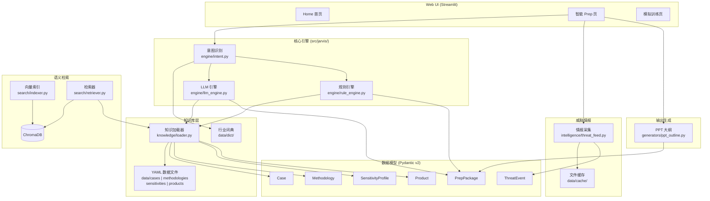
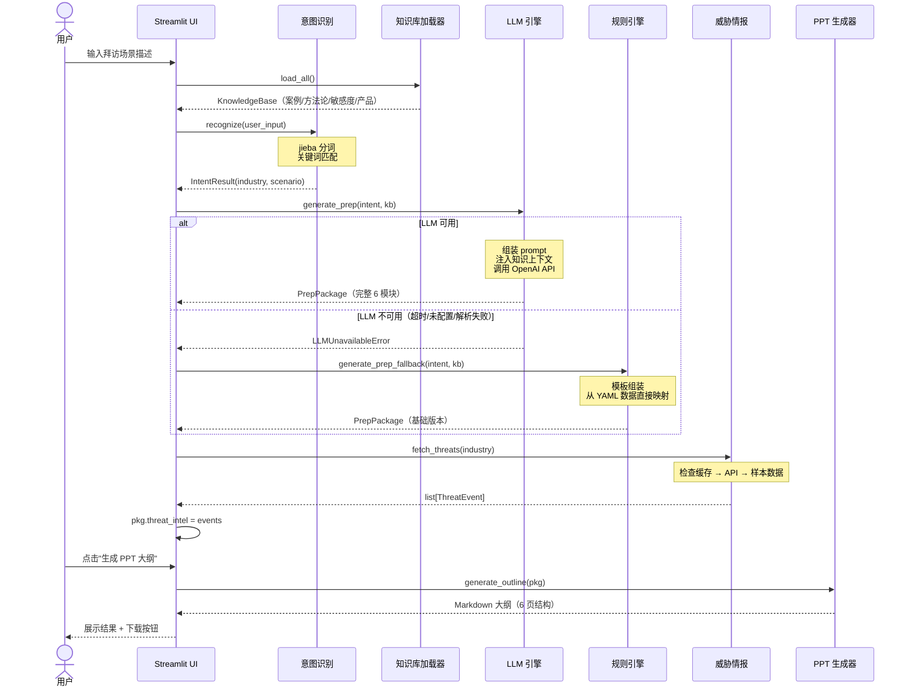

# JARVIS 架构设计文档

> **版本:** 0.3 | **最后更新:** 2026-06-13 | **状态:** MVP

---

## 系统架构总览

JARVIS 是一个 AI 驱动的销售拜访准备助手，核心目标是将散落的行业知识、威胁情报和销售方法论，通过 LLM 聚合成一份结构化的 Prep 包，帮助销售在拜访前 10 分钟内完成过去需要 2 小时的准备工作。



---

## 模块详解

### 1. 数据模型层 (`models/`)

**职责：** 定义系统中所有领域对象的类型契约，是整个系统的数据骨架。

**模型清单：**

| 模型 | 文件 | 职责 |
|------|------|------|
| `Case` | `case.py` | 销售案例 — 包含痛点（表层/深层）、解决方案、话术要点、追问清单 |
| `Methodology` | `methodology.py` | 销售方法论 — 有序步骤、适用场景、行业匹配标签 |
| `SensitivityProfile` | `sensitivity.py` | 行业敏感度画像 — 主要/次要敏感点、绝对雷区、共情话术 |
| `Product` | `product.py` | 产品信息 — 功能特性、适用行业和场景 |
| `PrepPackage` | `prep_package.py` | 最终输出 — 6 大模块（场景判断、敏感提醒、案例匹配、追问清单、方案方向、话术要点）+ 可选威胁情报 |
| `ThreatEvent` | `prep_package.py` | 威胁事件 — 标题、日期、行业、描述、来源链接 |

**设计决策：**

**为什么选择 Pydantic v2 而不是 dataclass 或 TypedDict？**

核心原因是 **运行时校验 + 序列化能力**。JARVIS 的数据来源多样：YAML 文件加载、LLM JSON 输出、外部 API 响应——这些都是"不可信输入"。Pydantic v2 在数据边界处提供强制类型校验和自动类型转换，确保非法数据不可能进入系统内部。同时 `model_dump()` / `model_validate()` 提供了与 JSON/YAML 之间的无缝序列化，这对 LLM 输出的 JSON 解析尤为关键。

**为什么使用 `model_validator` 做跨字段校验？**

`Case` 模型的 ID 必须等于 `{industry}_{scenario}`，这是一个跨字段约束。Pydantic 的 `@model_validator(mode="after")` 允许在所有单字段校验通过后执行跨字段逻辑，比手写 `__post_init__` 更声明式，且错误信息自动包含在 `ValidationError` 中。

**为什么每个模型独立文件？**

- `PrepPackage` 依赖 `ThreatEvent`，放在一起是因为它们是"输出域"的内聚概念
- `Case`、`Methodology`、`SensitivityProfile`、`Product` 各自独立，是因为它们属于不同的知识子域，独立文件降低了 import 粒度，按需引入时不会触发无关模块加载
- `__init__.py` 统一 re-export，对外提供扁平的 `from jarvis.models import Case` 接口

---

### 2. 知识库层 (`knowledge/` + `data/`)

**职责：** 从 YAML 文件加载、校验并聚合所有领域知识数据。

**数据结构：**

```
data/
├── cases/                    # 行业案例（每文件一个完整案例）
│   ├── manufacturing_ransomware.yaml
│   ├── finance_compliance.yaml
│   └── healthcare_data_leak.yaml
├── methodologies/            # 销售方法论
│   ├── spin_selling.yaml
│   └── challenger_sale.yaml
├── sensitivities/            # 行业敏感度画像
│   ├── manufacturing_sens.yaml
│   ├── finance_sens.yaml
│   └── healthcare_sens.yaml
├── products/                 # 产品信息
│   └── edr_endpoint.yaml
├── dict/                     # 行业关键词词典
│   └── industry_keywords.yaml
└── cache/                    # 运行时缓存（威胁情报等）
```

**核心组件 `KnowledgeBase`：**

`loader.py` 中的 `KnowledgeBase` 是一个纯容器类，持有四类已校验数据的列表。`load_all()` 一次性加载全部数据，各 `load_*` 函数独立可用——支持按需加载和测试中的局部加载。

**设计决策：**

**为什么选择 YAML 而不是数据库？**

1. **领域专家可编辑性：** 案例和方法论的编写者是销售培训专家和解决方案架构师，不是工程师。YAML 的可读性和可编辑性远优于 SQL 或 MongoDB 文档，降低了知识维护的技术门槛
2. **版本控制友好：** YAML 是纯文本，可以完整纳入 Git 版本控制。每次案例修改都有 diff 可追溯，这在合规要求较高的 to-B 销售场景中很重要
3. **数据量级不需要数据库：** 当前知识库在数十条量级（3 个案例、2 个方法论、3 个敏感度画像），远未达到 YAML 解析的性能瓶颈。YAGNI 原则——不需要为未来的假想规模提前引入复杂度
4. **部署简化：** 无需额外数据库进程，纯文件系统依赖，与 Streamlit 的单进程部署模型一致

**为什么每个案例一个文件而不是合并成大文件？**

- **独立维护：** 每个案例可以独立创建、修改、review，不会产生合并冲突
- **加载容错：** `_load_yaml_files()` 在遇到单个文件解析失败时 `logger.warning` 并跳过，不影响其他案例加载。如果合并成一个大文件，一个语法错误会导致所有案例丢失
- **可扩展性：** 新增案例只需新增一个 `.yaml` 文件，无需理解现有文件结构

**为什么在加载时校验而不是写入时校验？**

YAML 文件是"静态数据源"——由人工编写，不经过 API 写入。校验放在加载时（`model_validate`），确保：
1. 即使 YAML 文件被手工编辑出错，系统在启动时就能发现问题（fail-fast）
2. 校验逻辑集中在 loader 层，不需要在每个消费者处重复
3. 无效文件被跳过而非崩溃（`try/except` 包裹），实现优雅降级

---

### 3. 意图识别 (`engine/intent.py`)

**职责：** 从用户的自然语言输入中识别行业和场景两个结构化维度。

**输出结构：** `IntentResult(industry, scenario, raw_input)` — 一个轻量 dataclass，允许字段为 `None`（识别失败时）。

**识别流程：**

1. 从 `data/dict/industry_keywords.yaml` 加载行业 → 关键词映射
2. 构建反向映射：关键词 → 行业
3. 使用 jieba 对中文输入进行分词
4. 遍历分词结果，命中反向映射则确定行业
5. 使用硬编码的场景关键词表做子串匹配，确定场景

**设计决策：**

**为什么选择关键词 + jieba 而不是 NLU 模型（如 Rasa/spaCy NER）？**

这是一个典型的 **MVP 正确选择 vs. 过度工程** 的决策：

1. **领域封闭性：** JARVIS 的行业范围是预定义的（制造业、金融、医疗等 7 个行业），不需要开放域意图识别。关键词匹配在封闭域内的准确率接近 100%
2. **延迟要求：** 用户在 UI 上点击"生成"后期望秒级响应。jieba 分词 + 关键词匹配在毫秒级完成，而加载 NLU 模型可能需要数秒的冷启动
3. **零训练数据：** MVP 阶段没有标注数据来训练 NLU 模型。关键词词典由领域专家直接编写，无需数据标注流程
4. **可解释性：** 每个识别结果都可以追溯到具体命中的关键词，方便调试和用户反馈

**为什么用 YAML 词典而不是硬编码？**

词典外置到 `data/dict/industry_keywords.yaml` 使得：
- 新增行业或关键词只需编辑 YAML 文件，无需修改代码
- 词典可以纳入版本控制并独立 review
- 支持中英文双语关键词在同一个数据结构中管理

**jieba 不可用时的降级策略：**

代码中 `import jieba` 在 `try/except` 块中，失败时回退到简单的 `text.lower().split()`。这保证了即使 jieba 未安装，系统仍可通过空格分词对英文输入提供基本的意图识别能力。

---

### 4. LLM 引擎 (`engine/llm_engine.py`)

**职责：** 调用 LLM API，基于知识库上下文和用户意图生成结构化 PrepPackage。

**核心依赖：** OpenAI Python SDK（兼容所有 OpenAI API 兼容端点）。

**Prompt 设计原则（不含具体 prompt 内容）：**

1. **知识上下文注入（Context Injection）：** prompt 不是静态模板，而是动态组装的。根据 `IntentResult` 的行业/场景，从 `KnowledgeBase` 中筛选相关案例、方法论和敏感度信息，作为上下文注入 prompt。这确保 LLM 生成的内容有据可依，而非"幻觉"式输出

2. **结构化输出强制（Structured Output Enforcement）：** 通过 `response_format={"type": "json_object"}` 要求 LLM 以 JSON 格式响应，并在 prompt 中明确指定 6 个必需字段及其语义。输出格式契约与 `PrepPackage` 模型严格对齐

3. **角色设定（Role Setting）：** 将 LLM 定位为"网络安全产品的销售准备专家"，建立领域专家人设，引导输出风格向专业、结构化方向靠拢

4. **温度控制（Temperature = 0.7）：** 选择 0.7 而非更低值，是在"输出稳定性"和"创造性"之间的平衡——Prep 包需要一定的创造性（如话术建议），但不应偏离事实基础太远

**JSON 清洗与容错策略：**

```
LLM 原始输出 → _clean_llm_json() → json.loads() → PrepPackage.model_validate()
                    ↓ 失败                  ↓ 失败                    ↓ 失败
            去除 markdown 围栏      _extract_json_object()     _parse_partial_json()
            （```json...```）      正则提取 {} 平衡体          缺失字段填默认值
```

这是一个 **三层防御** 设计：

| 层级 | 策略 | 应对场景 |
|------|------|----------|
| 第一层 | `_clean_llm_json()` | LLM 在 JSON 外包裹了 ` ```json ``` ` 的 markdown 代码围栏 |
| 第二层 | `_extract_json_object()` | JSON 前后有多余文字，用正则提取最外层 `{...}` |
| 第三层 | `_parse_partial_json()` | JSON 可解析但字段不全——用默认值填充缺失的 required 字段，保证至少 4/6 模块可恢复 |

**降级触发条件：**

- 未配置 `LLM_API_KEY` → 直接抛出 `LLMUnavailableError`
- API 调用超时（默认 8 秒）→ `httpx.TimeoutException` → `LLMUnavailableError`
- JSON 完全无法解析 → `LLMUnavailableError`
- 任何其他异常 → 统一包装为 `LLMUnavailableError`

`LLMUnavailableError` 是整个 LLM 层唯一的异常类型，上层（UI）只需 catch 它即可触发规则引擎降级，异常接口极简。

**环境变量配置：**

| 变量 | 默认值 | 说明 |
|------|--------|------|
| `LLM_API_KEY` | `""` | API 密钥，未配置时直接降级 |
| `LLM_BASE_URL` | `https://api.openai.com/v1` | 支持任意 OpenAI 兼容端点 |
| `LLM_MODEL` | `gpt-4o-mini` | 模型选择，可按成本和效果调整 |
| `LLM_TIMEOUT` | `8.0` | 超时秒数，平衡响应速度和成功率 |

---

### 5. 规则引擎降级 (`engine/rule_engine.py`)

**职责：** 在 LLM 不可用时，基于 YAML 知识库数据直接组装 PrepPackage，保证系统始终有输出。

**设计哲学：优雅降级（Graceful Degradation）**

系统的可用性优先级是：**有输出 > 高质量输出**。LLM 生成的 Prep 包在内容丰富度上优于规则引擎，但规则引擎保证了即使 LLM API 宕机、超时、或未配置，用户仍然能获得一份可用的 Prep 包。这比显示错误信息的用户体验好得多。

**降级触发流程：**

```
UI 层调用 LLM.generate_prep()
         ↓ 抛出 LLMUnavailableError
UI 层 catch → 调用 Rule.generate_prep_fallback()
         ↓
用相同的 IntentResult + KnowledgeBase 生成基础 Prep 包
```

**内容组装逻辑：**

| PrepPackage 模块 | 规则引擎策略 |
|------------------|--------------|
| `scenario_assessment` | 拼接行业、场景、紧急度（基于场景关键词的硬编码规则：ransomware/data_leak → high，其他 → medium） |
| `sensitivity_alerts` | 按行业匹配 `SensitivityProfile`，收集主要/次要敏感点和雷区 |
| `matched_cases` | 按行业匹配 `Case.id` 列表 |
| `follow_up_questions` | 从匹配案例中提取追问清单，无匹配时使用 8 个通用模板问题 |
| `solution_direction` | 按场景匹配 `Methodology`（取前 3 步），按行业匹配 `Product` |
| `talking_points` | 从首个匹配案例中提取话术要点，无匹配时给通用提示 |

**为什么选择模板组装而不是轻量 ML 模型？**

1. **确定性：** 模板输出完全可预测，方便测试和质量保证。ML 模型的输出不确定性在降级场景中是不可接受的
2. **零依赖：** 规则引擎不依赖任何外部服务或额外模型权重，是系统可用性的最后一道防线
3. **数据来源一致：** 规则引擎和 LLM 引擎使用同一个 `KnowledgeBase`，保证输出内容的事实基础一致

---

### 6. 语义检索 (`search/`)

**职责：** 提供基于语义相似度的案例检索能力，作为关键词匹配的增强层。

**双模块设计：**

- `indexer.py` — 构建阶段：将 `KnowledgeBase` 中的案例文档化后写入 ChromaDB 持久化向量索引
- `retriever.py` — 查询阶段：对用户输入做语义搜索，返回 `SearchResult(case_id, score, is_fallback)` 列表

**索引构建流程：**

每个 `Case` 被序列化为一段结构化文本（行业、场景、表层痛点、深层痛点、解决方案、参考事件），作为 ChromaDB 的一个 document。元数据（industry, scenario）同步存入，支持后续的元数据过滤。

**检索流程：**

```
用户查询 → ChromaDB 语义搜索（TOP_K=3）
              ↓
       过滤 score >= 0.5 的结果
              ↓ 结果为空
       keyword_fallback() → 基于 industry/scenario/pain_points 的加权匹配
```

**设计决策：**

**为什么选择 ChromaDB 而不是 FAISS / Pinecone / Weaviate？**

1. **嵌入式部署：** ChromaDB 是纯 Python 库，`PersistentClient` 直接写入本地文件系统，无需额外服务进程。这与 JARVIS 的单进程 Streamlit 部署模型完美契合
2. **内置 Embedding：** `DefaultEmbeddingFunction` 使用 `onnxruntime` 的本地 embedding 模型，无需调用外部 embedding API，避免了额外的网络延迟和 API 成本
3. **API 简洁：** `get_or_create_collection` + `upsert` + `query` 三个方法覆盖全部需求，学习成本极低
4. **够用即可：** 当前数据量（3 个案例）远未达到 ChromaDB 的性能上限。当案例数量增长到数百时再考虑迁移

**为什么设置 `SIMILARITY_THRESHOLD = 0.5`？**

ChromaDB 返回的是 L2 距离，通过 `1.0 - distance` 转换为相似度分数。0.5 的阈值是一个经验值：
- 低于 0.5 的结果通常与查询意图无关，引入噪音
- 高于 0.5 保证了结果的基本相关性
- 当无结果达标时自动降级到关键词匹配，保证召回率

**为什么需要关键词降级？**

语义搜索依赖 ChromaDB 和 embedding 模型，两者都可能失败（未安装、索引损坏、版本不兼容）。`keyword_fallback()` 使用简单的字符串匹配 + 加权评分（industry 0.4 + scenario 0.3 + pain_points 0.2），确保在任何情况下都有检索结果返回。`SearchResult.is_fallback` 标记来源，方便上层区分结果质量。

---

### 7. 威胁情报 (`intelligence/threat_feed.py`)

**职责：** 为 Prep 包提供行业相关的近期威胁事件，增强拜访准备的时效性和紧迫感。

**数据流：**

```
fetch_threats(industry)
    ↓
检查文件缓存（data/cache/threats_{industry}.json）
    ↓ 缓存过期或不存在
调用外部 API（THREAT_INTEL_API_KEY）
    ↓ API 失败或未配置
返回硬编码样本数据（SAMPLE_THREATS）
    ↓ 标记 [Sample] 前缀
```

**缓存策略：**

- **存储位置：** `data/cache/threats_{industry}.json` — 每个行业独立缓存文件
- **TTL：** 24 小时（`CACHE_TTL = 86400`）— 威胁情报的时效性以天为单位
- **格式：** `{"timestamp": <epoch>, "events": [<ThreatEvent dumps>]}`
- **容错：** 缓存读取失败（文件损坏、格式错误）时静默跳过，等效于缓存未命中

**设计决策：**

**为什么采用静默降级（Silent Degradation）？**

威胁情报是 Prep 包的 **增强项** 而非核心项。`PrepPackage.threat_intel` 的默认值是空列表 `[]`——没有威胁情报，Prep 包仍然完整可用。因此情报模块的设计原则是 **绝不抛出异常到调用方**：

| 场景 | 行为 |
|------|------|
| 缓存命中且未过期 | 返回缓存数据 |
| API 调用成功 | 写入缓存，返回数据 |
| API 失败或未配置 | 返回硬编码样本数据，标题加 `[Sample]` 前缀 |
| 行业无样本数据 | 返回空列表 |

**为什么需要样本数据？**

在 Demo 和测试场景中，外部 API 通常不可用。硬编码的样本数据确保 UI 上始终能展示威胁情报模块，让演示效果完整。`[Sample]` 前缀明确告知用户这不是实时数据。

**未来集成方向：**

`_fetch_from_api()` 目前是 `NotImplementedError` 占位。生产环境中计划集成 VirusTotal 或 AlienVault OTX 的威胁情报 API，按行业关键词过滤近期事件。

---

### 8. PPT 大纲生成 (`generators/ppt_outline.py`)

**职责：** 将 `PrepPackage` 转换为 Markdown 格式的 PPT 大纲，可直接用于幻灯片制作。

**6 页结构设计：**

| 页码 | 标题 | 数据来源 |
|------|------|----------|
| 1 | 封面 | 固定标题 + "Auto-generated by JARVIS" |
| 2 | 行业态势 & 威胁评估 | `scenario_assessment` + `threat_intel`（可选） |
| 3 | 问题诊断 | `sensitivity_alerts` |
| 4 | 方案方向 | `solution_direction` |
| 5 | 案例参考 & 追问清单 | `matched_cases` + `follow_up_questions` |
| 6 | 话术要点 & 下一步 | `talking_points` |

**设计决策：**

**为什么选择纯本地映射而不是 LLM 生成？**

1. **确定性输出：** PrepPackage → Markdown 的映射是确定性的，相同输入永远产生相同输出。这方便用户预期结果，也方便自动化测试
2. **零额外成本：** 不需要额外的 LLM API 调用，不增加延迟和费用
3. **速度：** 字符串拼接操作在微秒级完成，用户点击"生成 PPT 大纲"后几乎瞬间得到结果
4. **可定制性：** 6 页结构对应标准销售 Prep 演示流程，未来可根据用户反馈调整页面编排

**为什么是 6 页？**

来自销售培训的最佳实践：一次有效的客户拜访准备 briefing 应覆盖"背景 → 问题 → 方案 → 证据 → 行动"5 个环节，加上封面共 6 页。这个结构在多数 to-B 安全产品销售场景中通用。

---

### 9. Web UI (`app/`)

**职责：** 提供基于 Streamlit 的多页面交互界面，连接用户与核心引擎。

**页面结构：**

| 页面 | 文件 | 功能 |
|------|------|------|
| Home | `Home.py` | 产品介绍、功能概览、导航入口 |
| 智能 Prep | `pages/1_智能Prep.py` | 核心功能 — 输入场景、生成 Prep 包、查看结果、生成 PPT 大纲 |
| 模拟训练 | `pages/2_模拟训练.py` | 占位页 — 展示未来路线图（角色扮演练习功能） |

**智能 Prep 页面核心流程：**

```
用户输入文本 → 点击"生成 Prep 包"
    ↓
load_all() 加载知识库
    ↓
recognize() 识别意图 → 展示行业/场景
    ↓
generate_prep() 尝试 LLM 生成
    ↓ 失败（LLMUnavailableError）
generate_prep_fallback() 规则引擎降级 → 提示"已切换为基础模式"
    ↓
fetch_threats() 补充威胁情报
    ↓
存入 st.session_state["pkg"] → 渲染 6 个 Expander 展示模块
    ↓
用户点击"生成 PPT 大纲" → generate_outline() → 展示 + 下载按钮
```

**设计决策：**

**为什么选择 Streamlit？**

1. **开发效率：** Streamlit 让 Python 工程师在几十行代码内搭建出可用的 Web UI，无需学习前端框架（React/Vue）
2. **与 Python 生态无缝集成：** 核心引擎是纯 Python，Streamlit 也是纯 Python，`import` 即用，无需 API 层或序列化协议
3. **快速原型验证：** MVP 阶段的核心目标是验证"知识库 + LLM → Prep 包"的价值假设，而非构建生产级 UI
4. **部署简单：** `streamlit run app/Home.py` 一条命令启动，适合内部工具的分发模式

**核心引擎零 UI 依赖原则：**

这是 JARVIS 最重要的架构约束之一。核心引擎（`src/jarvis/`）中 **没有任何 Streamlit 依赖**。所有 UI 代码都在 `app/` 目录中，通过 `import` 调用核心引擎。这意味着：

- 核心引擎可以独立运行在 CLI、Jupyter Notebook、API 服务或测试环境中
- 未来更换 UI 框架（如迁移到 Gradio、FastAPI + React）不需要修改核心引擎代码
- 单元测试不依赖 Streamlit 的运行时环境

**Session State 管理：**

- `st.session_state["pkg"]`：缓存最近生成的 `PrepPackage`，避免页面交互（如切换 Expander）时重新生成
- `st.session_state["ppt_outline"]`：缓存 PPT 大纲文本，支持下载按钮的异步触发

**导入容错：**

`1_智能Prep.py` 的顶层 import 被 `try/except` 包裹。如果核心引擎模块缺失（如部署环境不完整），页面仍然能渲染，只是在用户点击生成时显示友好的错误信息，而非 Streamlit 默认的堆栈跟踪。

---

## 数据流图

以下展示一次完整的 Prep 包生成流程，从用户输入到最终展示：



---

## 关键技术决策

| 决策点 | 选择 | 考虑过的替代方案 | 选择理由 |
|--------|------|------------------|----------|
| 数据模型 | Pydantic v2 | dataclass, TypedDict, attrs | 运行时校验 + JSON 序列化 + 自动文档 |
| 知识存储 | YAML 文件 | SQLite, PostgreSQL, MongoDB | 领域专家可编辑、Git 友好、零运维 |
| 意图识别 | 关键词 + jieba | Rasa NLU, spaCy NER, LLM-based | 封闭域高精度、零训练数据、毫秒级延迟 |
| LLM 接口 | OpenAI SDK | LangChain, LlamaIndex, 自建 Agent 框架 | 轻量直接、无框架锁定、兼容多端点 |
| 向量数据库 | ChromaDB | FAISS, Pinecone, Weaviate | 嵌入式部署、内置 embedding、零运维 |
| LLM 降级 | 规则模板引擎 | 轻量本地模型、缓存历史结果 | 确定性输出、零依赖、数据来源一致 |
| 威胁情报降级 | 静默降级 + 样本数据 | 报错提示、跳过模块 | Demo 完整性、用户体验无中断 |
| Web 框架 | Streamlit | Gradio, FastAPI + React, Flask | Python 原生、开发速度快、部署简单 |
| PPT 生成 | 本地模板映射 | LLM 生成、python-pptx 直接输出 | 确定性、零成本、微秒级速度 |

---

## 设计原则

### 1. 核心引擎零 UI 依赖

`src/jarvis/` 中的所有模块不依赖任何 UI 框架。`app/` 通过 `import` 消费核心引擎的接口。这确保了核心逻辑的可移植性和可测试性。

### 2. 静默降级

**任何外部依赖的失败都不应导致系统崩溃。** 具体实现：

| 依赖 | 降级策略 |
|------|----------|
| LLM API | 规则引擎接管，输出基础 Prep 包 |
| ChromaDB | 关键词匹配接管检索 |
| jieba | 空格分词接管中文处理 |
| 威胁情报 API | 文件缓存 → 硬编码样本数据 |
| YAML 文件 | 跳过损坏文件，继续加载其他文件 |
| 单个模型校验失败 | warning 日志，跳过该条数据 |

降级链的深度设计保证了系统在最小配置下（无 API Key、无 ChromaDB、无 jieba）仍然能运行并输出结果。

### 3. 测试先行

项目遵循 AC → Test → Implementation 的开发流程：
- 每个 User Story 有明确的 Acceptance Criteria
- 测试文件与实现文件同步编写
- Pydantic 模型的 `Field` 约束本身就是可执行的测试规格

### 4. 数据驱动

配置优于硬编码，外置优于内嵌：
- 行业关键词在 `data/dict/industry_keywords.yaml` 中管理
- 案例、方法论、敏感度画像、产品信息均为 YAML 文件
- LLM 配置（API Key、模型、超时）通过环境变量注入
- 新增行业/案例/产品只需添加 YAML 文件，无需修改代码

### 5. 最小依赖原则

每个模块只 import 它真正需要的依赖。可选依赖（chromadb、jieba）通过 `try/except ImportError` 实现软依赖——存在时增强功能，不存在时降级运行。这保证了核心功能在任何环境下都可用。
